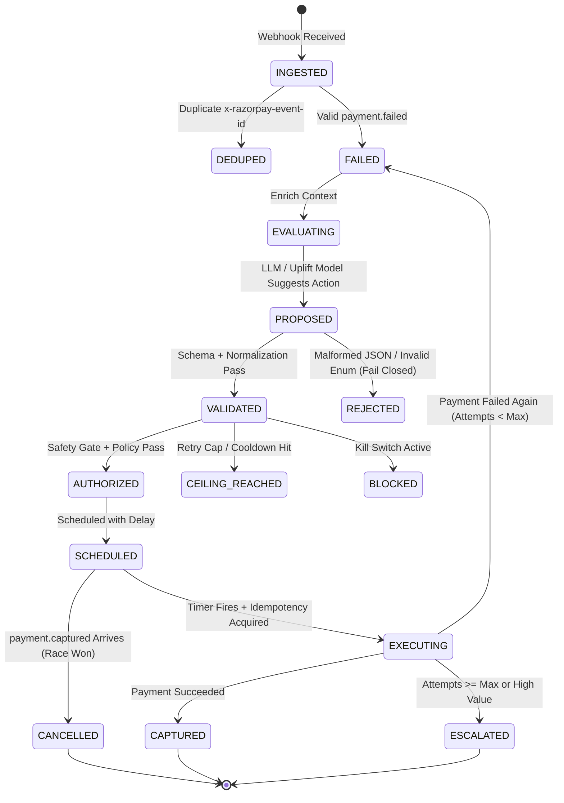

# PayRecover AI — State-Space Invariant Matrix

This matrix governs all state transitions, asynchronous event arrivals, concurrency races, and expected safety outcomes. Every row corresponds to a mandatory automated regression test.

---

## The 5D State-Space Verification Matrix

| Row ID | Current State | Incoming Event / Condition | Proposed / In-Flight Action | Concurrency Condition | Expected Outcome | System Invariant Enforced | Automated Test Target |
| :--- | :--- | :--- | :--- | :--- | :--- | :--- | :--- |
| **SS-01** | `FAILED` | `payment.failed` (Duplicate) | `retry_payment` | Duplicate delivery | **NOOP / Deduped** (`duplicate_execution_count++`) | Exactly-once event ingestion; no double queueing | `tests/unit/test_state_machine.py::test_duplicate_webhook_dedup` |
| **SS-02** | `FAILED` | `payment.captured` | `retry_payment` (Scheduled) | Captured webhook arrives before retry timer fires | **CANCEL_SCHEDULED_ACTION** (`stale_action_rejection_count++`) | Stale retry cancellation; never charge already captured payment | `tests/unit/test_state_machine.py::test_cancel_stale_retry_on_captured` |
| **SS-03** | `FAILED` | None (Timer triggers) | `retry_payment` | Two worker nodes claim same scheduled action concurrently | **Single execution wins; second receives IDEMPOTENCY_CONFLICT** | Idempotency lock prevents double charges under concurrency | `tests/integration/test_concurrency.py::test_concurrent_worker_race` |
| **SS-04** | `CAPTURED` | `payment.failed` (Out-of-order) | Any | Out-of-order older failure event arrives after capture | **DISCARD_EVENT** (State remains `CAPTURED`) | Terminal success state is irreversible by stale failure events | `tests/unit/test_state_machine.py::test_out_of_order_failed_after_captured` |
| **SS-05** | `FAILED` | `refund.created` / `dispute.created` | `retry_payment` | Dispute/refund occurs while recovery is in progress | **ABORT_AND_HOLD** (State moves to `DISPUTED`) | Immediate freeze on disputed/refunded accounts | `tests/unit/test_safety_kernel.py::test_dispute_halts_recovery` |
| **SS-06** | `FAILED` | `payment.failed` | `retry_payment` | Attempt count reaches 3 (Merchant limit) | **TRANSITION_TO_CEILING_REACHED** (Escalate or No Action) | Hard cap on retries enforced deterministically | `tests/unit/test_safety_kernel.py::test_max_retry_ceiling` |
| **SS-07** | `FAILED` | `payment.failed` | `notify_payment_link` | Cooldown period (2 hours) has not elapsed | **REJECT_ACTION** (Cooldown active) | Customer contact rate-limiting / spam prevention | `tests/unit/test_safety_kernel.py::test_notification_cooldown` |
| **SS-08** | `FAILED` | `payment.failed` | Any | Global Kill Switch is `ACTIVE` | **HALT_EXECUTION** (`kill_switch_rejection_count++`) | Universal circuit-breaker / emergency operator stop | `tests/unit/test_safety_kernel.py::test_kill_switch_halts_all` |
| **SS-09** | `FAILED` | `payment.failed` | LLM returns malformed JSON / unknown action | Single worker | **FAIL_CLOSED** (`policy_validation_failure_count++`, fallback to Static Rules) | Untrusted LLM output cannot cause runtime crash or unauthorized execution | `tests/unit/test_policy_engine.py::test_malformed_llm_json_fail_closed` |
| **SS-10** | `FAILED` | `payment.failed` | `retry_payment` | Razorpay API returns HTTP 504 / Gateway Timeout | Single worker | **STATE_REMAINS_IN_FLIGHT** (Poll status before retrying) | No blind re-attempt on ambiguous network timeouts | `tests/integration/test_executor.py::test_gateway_timeout_handling` |

---

## State Transition Diagram

